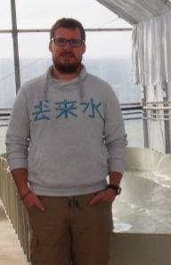
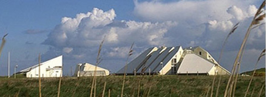

 
 

  

  
  

  

   
  Je suis maitre de conférences (assistant professor) en biologie végétale et biostatistique au [**Cnam-Intechmer**](http://www.intechmer.cnam.fr/intechmer/) à Cherbourg. Je suis rattaché au [**LUSAC**](http://lusac.unicaen.fr) pour mes recherches en écologie benthique.
   
   

 

